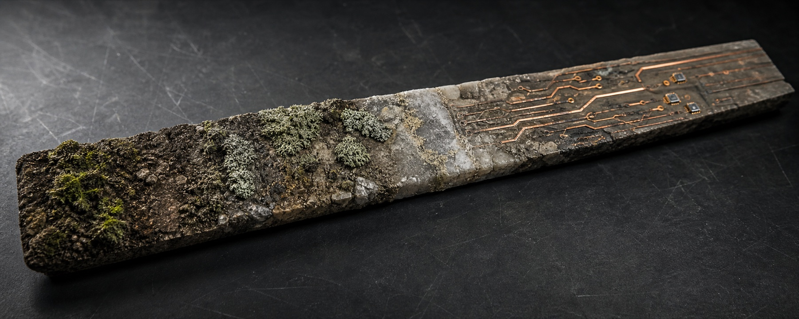

# Mason Cao

### I build software that has to answer to the physical world.

I am a rising high school senior, independent builder, and aspiring environmental computing researcher. I move between applied research, systems architecture, and product engineering, usually wherever software meets a messy physical system.

<pre>physical world -> data -> useful software</pre>

[Portfolio](https://mason-cao.github.io/) / [LinkedIn](https://www.linkedin.com/in/mason-cao-7a3760390/) / [Email](mailto:masoncao7@gmail.com)

## Current work

### [AERIS](https://github.com/mason-cao/aeris): environmental intelligence that runs locally

I am building a self-hosted system for a 50 km Houston study area. Its architecture joins eight environmental sources into five measurement channels, detects anomalies, and asks whether small local models can produce scientific explanations that survive checks against both retrieved context and independent sensor evidence.

The research question is bigger than the interface: **can cross-channel corroboration become a useful label-free signal for scientific attribution quality?**

`Python` `FastAPI` `PostgreSQL` `TimescaleDB` `scikit-learn` `Ollama` `ChromaDB`

### [TOI-3505.01 research](https://github.com/mason-cao/nasa-tess-exoplanet-analysis): exoplanet candidate vetting

Through the **GMU NASA Data Science & Astronomy Research Internship**, I am working on a dilution-aware, multi-epoch stress test of a TESS planet candidate using four TESS sectors, Gaia, public TFOP constraints, and ground-based observations.

One early finding changed the project: the delivered GMU observation does not contain a transit under the current ephemeris. Instead of hiding the miss, I am treating it as an ephemeris audit, a photometric benchmark, and a constraint on what the data can honestly support.

`Python` `Jupyter` `Astropy` `Photutils` `NumPy` `SciPy` `Pandas`

### [FreshTrack](https://github.com/mason-cao/freshtrack): a food-waste feedback loop people can use

FreshTrack is a deployed pantry PWA with barcode entry, expiration alerts, recipe matching, and waste analytics. I am now focused on the less glamorous part of product work: acquisition, behavior data, reliability, and scaling beyond a successful local build.

[Open the live app](https://freshtrack.up.railway.app)

`TypeScript` `Next.js 16` `React 19` `PostgreSQL` `Drizzle` `Auth.js` `Tailwind CSS` `Railway`

## Other things I build

My range also includes [word games](https://github.com/mason-cao/textris-game), Minecraft mods, [macOS utilities](https://github.com/mason-cao/detox), and [websites for real organizations](https://github.com/mason-cao/firststep). Different surface, same habit: find a real constraint, model it, and take the idea far enough that someone else can use it.

## Tools I reach for

| Kind of work | Working set |
| --- | --- |
| Research and numerical work | Python, Jupyter, NumPy, Pandas, SciPy, Astropy, scikit-learn |
| APIs and data infrastructure | FastAPI, PostgreSQL, TimescaleDB, SQLAlchemy, Drizzle, Docker |
| Product and interface | TypeScript, Next.js, React, Tailwind CSS, Mapbox GL JS, Recharts |
| Local inference | Ollama, ChromaDB, retrieval-augmented generation, model evaluation |
| Foundations and experiments | Java, C, SQL, game systems, Minecraft modding |

## A few rules I keep

1. Say what the data cannot prove.
2. Make failures observable.
3. Deploy before calling it a product.

If you are working on climate, sensing, scientific tooling, or a hard data problem connected to the physical world, I would like to hear what is difficult.
