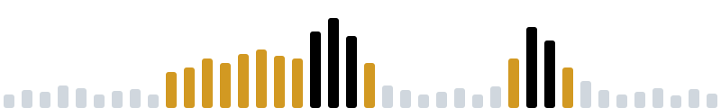

# Mason Cao

  <picture>
    <source media="(prefers-color-scheme: dark)" srcset="assets/ribbon-dark.svg">
    
  </picture>

I'm a student developing purpose oriented apps and projects. Try them out, and feel free to reach out if you have any questions, feedback, or anything else.

 &nbsp;**[AERIS](https://github.com/mason-cao/aeris)** &nbsp;Air quality anomalies across seven live sensor feeds.

 &nbsp;**[TOI-3505.01](https://github.com/mason-cao/nasa-tess-exoplanet-analysis)** &nbsp;First characterization of the candidate, from my NASA mentored internship.

 &nbsp;**[Detox](https://github.com/mason-cao/detox)** &nbsp;Mac screen time tracker built like an island game. &nbsp;[Download ↗](https://github.com/mason-cao/detox/releases)

 &nbsp;**[FreshTrack](https://github.com/mason-cao/freshtrack)** &nbsp;Scan a barcode to track food before it spoils. &nbsp;[Live ↗](https://freshtrack.up.railway.app)

 &nbsp;**[Nova Core](https://github.com/mason-cao/multi-agent-customer-intelligence-dashboard)** &nbsp;Customer analytics with churn scores that explain themselves. &nbsp;[Live ↗](https://nova-core-systems.vercel.app)

 &nbsp;**[Green Spark AI](https://github.com/ximena-pg-projects/green-spark-ai)** &nbsp;Turns school utility bills into a ranked fix list.

<samp>PYTHON 63%&nbsp;&nbsp;·&nbsp;&nbsp;TYPESCRIPT 22%&nbsp;&nbsp;·&nbsp;&nbsp;JAVASCRIPT 8%&nbsp;&nbsp;·&nbsp;&nbsp;CSS 5%&nbsp;&nbsp;·&nbsp;&nbsp;HTML 2%</samp>

<samp>[PERSONAL WEBSITE](https://mason-cao.github.io/)&nbsp;&nbsp;·&nbsp;&nbsp;[LINKEDIN](https://www.linkedin.com/in/mason-cao-7a3760390/)&nbsp;&nbsp;·&nbsp;&nbsp;[EMAIL](mailto:masoncao7@gmail.com)</samp>
